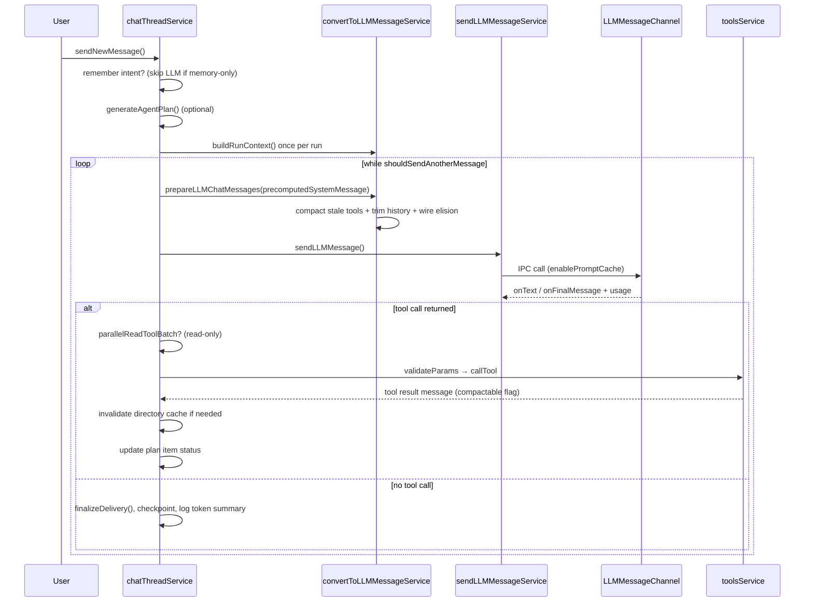

# Trove Architecture

This document describes how Trove is structured on top of VS Code OSS: process boundaries, the agent loop, token economy, IPC, core services, and conventions for extending the system.

---

## 1. High-level overview

Trove is not a VS Code extension. It is a **workbench contribution** compiled into the editor binary, with privileged access to the file system, terminal, and main process (for LLM HTTP calls and SQLite).

```
┌─────────────────────────────────────────────────────────────────────────┐
│                         Electron Application                            │
├──────────────────────────────┬──────────────────────────────────────────┤
│     Browser (Renderer)       │         Electron Main                    │
│  VS Code Workbench + DOM     │  Node.js · fs · crypto · HTTP · SQLite   │
│                              │                                          │
│  ┌────────────────────────┐  │  ┌────────────────────────────────────┐  │
│  │  trove/browser/        │  │  │  trove/electron-main/              │  │
│  │  · chatThreadService   │◄─┼──┤  · sendLLMMessageChannel           │  │
│  │  · toolsService        │  │  │  · sendLLMMessage.impl (HTTP)      │  │
│  │  · convertToLLM...     │  │  │  · repoIntelligence (SQLite)       │  │
│  │  · webSearchService    │  │  │  · mcpChannel · troveSCM · metrics   │  │
│  │  · React UI (sidebar)  │  │  └────────────────────────────────────┘  │
│  └──────────┬─────────────┘  │                                          │
│             │ imports         │                                          │
│  ┌──────────▼─────────────┐  │                                          │
│  │  trove/common/         │  │                                          │
│  │  types · prompts · IPC │  │                                          │
│  │  interfaces (no I/O)   │  │                                          │
│  └────────────────────────┘  │                                          │
└──────────────────────────────┴──────────────────────────────────────────┘
```

**Golden rule:** Browser code must not import Node APIs or touch the network for LLM calls directly. Main process must not touch the DOM. Shared logic belongs in `common/` as types and pure helpers.

Channel registration happens in `src/vs/code/electron-main/app.ts` (search for `trove-channel-`).

---

## 2. Directory map

All Trove code lives under `src/vs/workbench/contrib/trove/`.

| Path | Role |
|------|------|
| `common/` | Types, prompts, settings schemas, IPC service interfaces. No Node, no DOM. |
| `browser/` | Workbench services, tool execution, chat state machine, React mount points. |
| `browser/react/` | React UI (sidebar chat, settings, onboarding, diff widgets). Built with `tsup` → `out/`. |
| `electron-main/` | LLM HTTP, SQLite repo intelligence, MCP main side, SCM, metrics, updates. |
| `browser/trove.contribution.ts` | Entry point: registers all Trove services on workbench startup. |
| `browser/media/trove.css` | Global Trove styles (watermark, editor chrome). |

### Key browser services

| Service | File | Responsibility |
|---------|------|----------------|
| Chat / agent loop | `chatThreadService.ts` | Thread state, `while` agent loop, tool dispatch, checkpoints, idle status, token totals |
| LLM message prep | `convertToLLMMessageService.ts` | System prompt, history, provider wire format, context trim, compaction |
| Tools | `toolsService.ts` | Validate, execute, stringify results for 16+ builtin tools |
| Web search | `webSearchService.ts` | Tavily HTTP search for `search_web` tool |
| Terminal tools | `terminalToolService.ts` | Shell integration, persistent terminals, exit codes |
| Agent delivery | `agentDeliveryService.ts` | Post-run build/server/localhost detection |
| Edit / diffs | `editCodeService.ts` | Inline diff areas, accept/reject, snapshots |
| Autocomplete | `autocompleteService.ts` | FIM requests; optional codebase context |
| Repo intel (proxy) | `repoIntelligenceService.ts` | Browser facade; `.troverules` loading |
| Context gathering | `contextGatheringService.ts` | Recently viewed code snippets |
| Plan generation | `agentPlan.ts` | Pre-run bullet plan + status updates |
| Parallel reads | `parallelReadToolBatch.ts` | Batch read-only tool calls |
| Context trim | `contextWindowTrim.ts` | Token budget trimming for long threads |
| Tool compaction | `toolResultCompaction.ts` | Replace stale read/search tool bodies with short refs |
| Wire trim | `wireMessageTrim.ts` | Char-budget elision of oldest tool results on wire |
| Memory intent | `chatMemoryIntent.ts` | Parse “remember that …” chat messages |
| Workspace preview | `openWorkspacePreviewAction.ts`, `simpleBrowserOpen.ts` | Open localhost preview in Simple Browser |

### Key common modules (token economy)

| Module | File | Responsibility |
|--------|------|----------------|
| Prompt cache helpers | `promptCache.ts` | `cache_control` blocks for routed Anthropic models |
| Token usage | `llmMessageUsage.ts` | Normalize provider usage; per-run totals and summary log |
| Directory tree cache | `directoryStrService.ts` | Workspace tree string with invalidation on edits |

### Key main-process modules

| Module | File | Responsibility |
|--------|------|----------------|
| LLM IPC | `sendLLMMessageChannel.ts` | Routes streaming events by `requestId` |
| LLM HTTP | `llmMessage/sendLLMMessage.impl.ts` | Provider-specific API calls, prompt caching headers |
| Repo intelligence | `repoIntelligence/repoIntelligenceService.impl.ts` | Profile generation, chunk index, search |
| SQLite schema | `repoIntelligence/repoIntelligenceDb.ts` | Workspace profiles, FTS5 `code_chunks` |
| Workspace scan | `repoIntelligence/workspaceScanner.ts` | Detect stack, collect files |
| Code chunker | `repoIntelligence/codeChunker.ts` | Split files for search index |

---

## 3. Layer rules and imports

| Layer | May import | Must not import |
|-------|------------|-----------------|
| `electron-main/` | Node, `common/` | `browser/`, DOM APIs |
| `browser/` | VS Code browser APIs, `common/` | Node-only modules |
| `common/` | Other `common/`, base utilities | Node, DOM |
| `browser/react/src/` | React, browser services via accessor bridge | Direct main-process APIs |

React components reach VS Code services through `browser/react/src/util/services.tsx` (instantiation service bridge).

**React build notes** (`browser/react/README.md`):

- External imports must use a `.js` extension.
- Keep `src/` one folder deep so `tsup` externals detection works.
- Dev app loads bundles from `out/vs/workbench/contrib/trove/browser/react/out/` — `build.js` syncs after each build.

---

## 4. The agentic loop

`chatThreadService.ts` owns the state machine. High-level flow:



### Stream state

`ThreadStreamState` is a discriminated union: `LLM | tool | awaiting_user | idle | undefined`. User approval for edits, terminal, or MCP tools sets `awaiting_user` until approved or rejected.

While `idle`, the UI shows **`idleStatus`** (`{ title, detail? }`) — e.g. “Building workspace context”, “Waiting for claude-…”, “Planning parallel reads”.

### Chat modes (`common/troveSettingsTypes.ts`)

| Mode | Tools |
|------|-------|
| `agent` | All builtins + MCP |
| `gather` | Read/search only (no edit, delete, terminal) |
| `normal` | No tools |

---

## 5. Message model

Defined in `common/chatThreadServiceTypes.ts`. The UI (`SidebarChat.tsx`) renders each `role`.

| Role | Purpose |
|------|---------|
| `user` | User text + `stagingSelections` (staged files/context) |
| `assistant` | Model text + optional reasoning |
| `tool` | Tool request / running / success / error / rejected; success may set `compactable: true` |
| `checkpoint` | File snapshots for rewind (`user_edit` \| `tool_edit`) |
| `plan` | Checklist items (`pending` \| `done` \| `skipped`) |
| `interrupted_streaming_tool` | Decorative cancel marker |

**Warning in source:** changing `ChatMessage` shape requires migration — persisted in VS Code storage.

---

## 6. LLM pipeline

### 6.1 Message preparation (`convertToLLMMessageService.ts`)

Before each LLM call:

1. **`buildRunContext`** (once per agent run) — builds the full system string: directory tree, repo profile, `.troverules`, memory, tool definitions.
2. **`prepareLLMChatMessages`** (each loop turn) — reuses `precomputedSystemMessage` when provided.
3. **`trimChatMessagesForContextWindow`** — structural history trim when over budget.
4. **`compactStaleToolResults`** — replaces old read/search tool bodies outside the protected tail with one-line references.
5. Convert internal `ChatMessage[]` to provider format (Anthropic / OpenAI / Gemini).
6. **Wire trim** (`wireMessageTrim.ts`) — `elideOldestToolResultsFirst` drops oldest tool bodies to fit char budget; uses `computeEffectiveOutputReserve` instead of reserving half the context window for output.

### 6.2 Prompt caching (`common/promptCache.ts`)

When `enablePromptCache` is on (Trove Settings → Agent & token economy):

- **Native Anthropic** — `cache_control: { type: 'ephemeral' }` on system, tools, and last user block; `anthropic-beta: prompt-caching-2024-07-31` header.
- **Routed Claude** (OpenRouter, Bedrock, LiteLLM, Azure) — system content blocks with `cache_control` via `applyRoutedAnthropicPromptCache`.

### 6.3 Token usage (`common/llmMessageUsage.ts`)

Each `onFinalMessage` may include normalized `LLMMessageUsage` (input, output, cache read/write). `chatThreadService` accumulates per-run totals and logs `[Trove agent token usage] …` when the run completes.

### 6.4 IPC bridge (`common/sendLLMMessageService.ts`)

- Generates `requestId` per request.
- Passes `enablePromptCache` from global settings.
- Stores callbacks in a local map (callbacks cannot cross IPC).
- `channel.call('sendLLMMessage', params)` → main process.
- Listens on `onText_sendLLMMessage`, `onFinalMessage_sendLLMMessage`, etc., filtered by `requestId`.

### 6.5 Main process (`sendLLMMessageChannel.ts` + `sendLLMMessage.impl.ts`)

- Emits streaming events with `requestId`.
- Performs HTTP to configured provider using keys from `ITroveSettingsService`.
- Returns usage metadata from provider responses.

### 6.6 Providers (`common/troveSettingsTypes.ts`, `common/modelCapabilities.ts`)

Supported providers include Anthropic, OpenAI, Gemini, Ollama, vLLM, LM Studio, LiteLLM, DeepSeek, OpenRouter, Groq, Mistral, xAI, Google Vertex, and OpenAI-compatible endpoints. Each feature (Chat, Autocomplete, Apply, SCM) can use a different model.

---

## 7. Builtin tools

Tools are declared in `common/prompt/prompts.ts` (`builtinTools`) and implemented in `browser/toolsService.ts` as three parallel maps:

- `validateParams[toolName]` — parse and type raw LLM params
- `callTool[toolName]` — execute
- `stringOfResult[toolName]` — format for LLM consumption

### Tool categories

**Read / search**

| Tool | Description |
|------|-------------|
| `read_file` | File contents (optional line range) |
| `ls_dir` | List directory |
| `get_dir_tree` | Tree view of folder |
| `search_pathnames_only` | Filename search |
| `search_for_files` | Content search (substring/regex) |
| `search_codebase` | FTS5-ranked semantic search (repo intelligence DB) |
| `search_in_file` | Line numbers matching query in one file |
| `search_web` | Live web search via Tavily (`webSearchService.ts`) |
| `read_lint_errors` | Linter diagnostics for a file |

**Edit**

| Tool | Description |
|------|-------------|
| `create_file_or_folder` | Create path |
| `delete_file_or_folder` | Delete (optional recursive) |
| `edit_file` | SEARCH/REPLACE blocks |
| `rewrite_file` | Replace entire file |

**Terminal**

| Tool | Description |
|------|-------------|
| `run_command` | One-shot shell command |
| `run_persistent_command` | Command in persistent terminal (dev servers) |
| `open_persistent_terminal` | New persistent terminal |
| `kill_persistent_terminal` | Close persistent terminal |

MCP tools are merged at prompt time when `chatMode === 'agent'`.

### Approval types

Destructive or sensitive tools require user approval (`toolsServiceTypes.ts`): edits, terminal commands, MCP invocations. Gather mode excludes these from the tool list entirely.

### Parallel read batching (`parallelReadToolBatch.ts`)

For read-only tools (including `search_web`), the agent may issue a lightweight discovery LLM call to collect up to 4 additional read calls, then execute the batch with `Promise.all` before the next main LLM turn.

### Tool result compaction (`toolResultCompaction.ts`)

Successful tool messages for read/search tools are marked `compactable: true`. On later turns, bodies outside the protected tail are replaced with lines like `read_file(path) → <42 lines, lines 1-42>; re-read if needed` before wire conversion.

### Directory tree cache (`directoryStrService.ts`)

The workspace tree string is cached for the run. `invalidateCache()` is called after edits, creates/deletes, and terminal commands that may change the tree.

---

## 8. Repo intelligence

Workspace understanding is **main-process SQLite**, exposed via `trove-channel-repoIntelligence`.

### Lifecycle

1. On workspace open, `workspaceScanner.ts` collects files, detects languages/frameworks/package managers/commands.
2. `codeChunker.ts` splits files into chunks; FTS5 virtual table enables `search_codebase`.
3. LLM generates `projectPurpose` and `architectureSummary` (cached).
4. Profile keyed by SHA-256 hash of workspace root; expires after 24h or manual refresh.

### Browser-side additions

- `repoIntelligenceService.ts` loads `.troverules` from workspace roots and watches for changes.
- Profile and search results injected into system prompt and tool handlers.

---

## 9. Checkpoints and inline diffs

`editCodeService.ts` tracks `DiffArea` per file. On each user message and agent edit, `chatThreadService` records a `checkpoint` with `VoidFileSnapshot` maps.

Users can:

- Accept/reject individual hunks in the editor
- Rewind to a checkpoint (restores snapshots)
- Approve/reject all pending changes from the delivery output panel

This is Trove’s undo model for agent edits — edits apply to live editor models, not a shadow workspace.

---

## 10. Agent delivery (`agentDeliveryService.ts`)

After terminal tool runs, delivery logic inspects output for:

- Build/compile/test success patterns
- Dev server start (`run_persistent_command`, npm/yarn dev scripts)
- Localhost URLs in stdout

Produces `AgentDeliverySummary` (`build_succeeded` \| `server_running` \| `verified`) rendered in `AgentDeliverySummary.tsx` as a **glass output panel**:

- Preview URL as primary display (click to open in workspace Simple Browser)
- **Approve / Reject** for all pending workspace diffs
- No caption headline — content-first layout

Preview opens via `trove.openWorkspacePreview` → `simpleBrowserOpen.ts` (activates built-in Simple Browser extension in the primary editor column).

---

## 11. Structured plans (`agentPlan.ts`)

Before the main tool loop (agent mode), a separate lightweight LLM call produces 3–7 bullet steps (`PlanMessage`). As tools complete, items move to `done` or `skipped`. Rendered by `PlanView.tsx`.

Uses `PLAN_OUTPUT_TOKEN_CAP` (300) so it does not consume main loop budget.

---

## 12. Chat memory intent (`chatMemoryIntent.ts`)

Natural-language remember requests are detected before the agent loop:

- Patterns: “remember that …”, “don’t forget …”, “save to memory: …”, etc.
- **Remember-only** messages append to `trove-memory.md` and return a confirmation without invoking the LLM.
- Messages with a memory clause *and* a follow-on task still go through the full agent.

---

## 13. Autocomplete

`autocompleteService.ts` sends FIM (fill-in-the-middle) requests to the configured Autocomplete model.

`autocompleteCodebaseContext.ts` optionally:

1. Extracts import hints from the current file
2. Queries repo intelligence search
3. Prepends top snippets as comments in the FIM prefix

---

## 14. Context gathering

`contextGatheringService.ts` caches recently viewed code regions. Snippets can be injected into chat context via `convertToLLMMessageService` (registered in `trove.contribution.ts`).

---

## 15. IPC channel registry

| Channel | Direction | Purpose |
|---------|-----------|---------|
| `trove-channel-llmMessage` | browser ↔ main | LLM send, abort, model list |
| `trove-channel-repoIntelligence` | browser → main | Profile, refresh, codebase search |
| `trove-channel-scm` | browser → main | Git commit, branch helpers |
| `trove-channel-metrics` | browser → main | Telemetry events |
| `trove-channel-mcp` | browser ↔ main | MCP discovery and tool calls |
| `trove-channel-update` | browser → main | Update check/install |

**Convention:** add methods to existing channels rather than creating new channels when possible.

Web search uses `IRequestService` in the browser (Tavily HTTPS) — not a separate IPC channel.

---

## 16. React UI

Built with React + Tailwind (`browser/react/`). Entry bundles:

| Bundle | Mount point |
|--------|-------------|
| `sidebar-tsx` | Chat sidebar (`SidebarChat.tsx`, `PlanView.tsx`, `AgentDeliverySummary.tsx`, `ChatActivityUI.tsx`) |
| `trove-settings-tsx` | Settings pane (models, token economy, web search) |
| `trove-onboarding` | First-run onboarding |
| `quick-edit-tsx` | Ctrl+K widget |
| `diff` | Inline diff UI |

### UI patterns

- **`glass-card` / `glass-panel`** — frosted glass morphism (`styles.css`)
- **`trove-output-panel`** — delivery summary with approve/reject actions
- **`trove-assistant-summary-prose`** — polished committed assistant markdown output
- **`CollapsibleCodeSnippet`** — expandable search/read results in chat
- **`BackgroundActivityPanel`** — live idle/LLM activity with status text

Build:

```bash
npm run buildreact      # one-shot
npm run watchreact      # watch mode
```

Output goes to `browser/react/out/` and is synced to `out/vs/workbench/contrib/trove/browser/react/out/`.

---

## 17. Settings and memory

| Mechanism | Location | Loaded by |
|-----------|----------|-----------|
| Trove Settings UI | VS Code storage | `troveSettingsService.ts` |
| `.troverules` | Workspace root | `repoIntelligenceService.ts` |
| `trove-memory.md` | `<userData>/trove-memory.md` | Main repo intelligence / prompts |
| Global AI instructions | Settings | `convertToLLMMessageService.ts` |
| `enablePromptCache` | Settings → Agent & token economy | `sendLLMMessageService.ts` |
| `enableWebSearch` / `webSearchApiKey` | Settings → Agent & token economy | `webSearchService.ts` |

Path helper: `common/troveMemoryPaths.ts`.

---

## 18. Registration and startup

`trove.contribution.ts` is imported by the workbench and side-effect-imports every service. Order matters for some dependencies (e.g. `editCodeService` before chat, `toolsService` before `chatThreadService`).

Common services (`sendLLMMessageService`, `troveSettingsService`, `IWebSearchService`) are registered as singletons and imported for DI registration side effects.

---

## 19. Extending Trove

### Add a builtin tool

1. Add param/result types in `common/toolsServiceTypes.ts`.
2. Add tool metadata in `common/prompt/prompts.ts` → `builtinTools`.
3. Implement `validateParams`, `callTool`, `stringOfResult` in `browser/toolsService.ts`.
4. Set `approvalType` if user confirmation is required.
5. If read-only and batchable, add to `parallelReadToolBatch.ts` allowlist.
6. If large output, add to `toolResultCompaction.ts` compactable set.
7. Add tests if logic is non-trivial.

### Add a new chat message type

1. Extend union in `common/chatThreadServiceTypes.ts`.
2. Handle persistence implications (storage migration).
3. Add renderer branch in `SidebarChat.tsx` (and related components).

### Add main-process capability

1. Implement in `electron-main/`.
2. Expose via existing IPC channel or new channel registered in `app.ts`.
3. Add browser proxy in `common/` or `browser/`.

### Cross-process rule

Never call Node or `fetch` for LLM from the browser. Never manipulate editor models from main process.

---

## 20. Testing

| Area | Location |
|------|----------|
| Trove unit tests | `browser/test/*.test.ts`, `electron-main/repoIntelligence/test/` |
| Token economy tests | `wireMessageTrim.test.ts`, `toolResultCompaction.test.ts`, `promptCache.test.ts`, `llmMessageUsage.test.ts` |
| Memory intent tests | `chatMemoryIntent.test.ts` |
| VS Code suite | `npm run test-node`, `npm run test-browser` |
| Layer checker | `npm run valid-layers-check` |

See also [TROVE_TEST_PLAN.md](TROVE_TEST_PLAN.md) for manual QA scenarios.

---

## 21. Relationship to VS Code

Trove inherits from VS Code OSS 1.99.x (`package.json` version). Upstream provides:

- Editor, terminal, SCM, extensions, debugging, remote
- Build pipeline (`gulp`, `build/`)
- Extension host and marketplace compatibility

Trove-specific changes are concentrated in `contrib/trove/` plus channel registration in `electron-main/app.ts` and product branding in `product.json`.

---

## 22. Further reading

| Document | Content |
|----------|---------|
| [README.md](README.md) | Build instructions, prerequisites, data paths |
| [TROVE_TOKEN_ARCHITECTURE_IMPLEMENTATION_GUIDE_v2.md](TROVE_TOKEN_ARCHITECTURE_IMPLEMENTATION_GUIDE_v2.md) | Token economics problem analysis and phased implementation |
| [TROVE_ARCHITECTURE_ANALYSIS.md](TROVE_ARCHITECTURE_ANALYSIS.md) | Gap analysis vs Cursor and incremental phase plan |
| [TROVE_TEST_PLAN.md](TROVE_TEST_PLAN.md) | Manual test checklist |
| [browser/react/README.md](src/vs/workbench/contrib/trove/browser/react/README.md) | React build constraints |
| [VS Code wiki](https://github.com/microsoft/vscode/wiki/How-to-Contribute) | Upstream compile/debug guidance |
